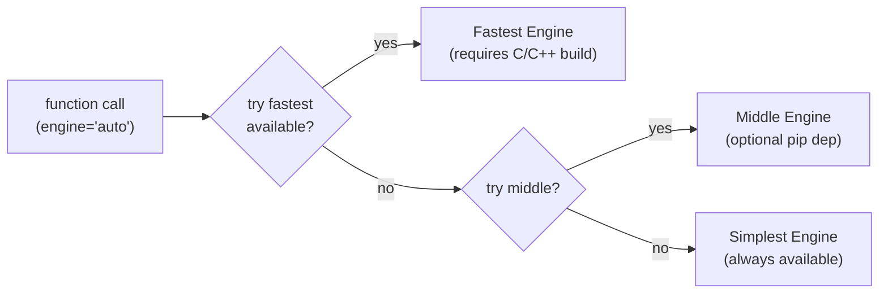

# Target Architecture

Best known target state for the triplets library.

**Status (updated 2026-06, after 0.1.0rc4):** the core architecture is implemented
on `main` — parser/tools/export engine dispatch, accessors, DuckDB support,
packaging, CI wheels, PyPI releases. The remaining unbuilt pieces are
**SHACL validation** and **SPARQL query** (prototypes live on this branch).
Sections are marked ✅ implemented / 🔀 implemented differently / 🚧 roadmap.

---

## Engine Fallback Pattern ✅

Every submodule with multiple engines follows the same logic — try fastest
available, fall back to simplest:



Engines live inside their own submodule. If a compiled `.so` or optional
dependency isn't present, the import fails silently and the dispatcher
picks the next engine down the chain.

Implementation improved on the original sketch: dispatchers are
**registry-driven** (name → module dict + `importlib`, alias dict, loaded-module
cache) instead of per-engine if-chains. See `parser/__init__.py` and
`export/__init__.py` (`get_engine` / `get_cimxml_engine`).

A fourth engine family emerged that the original vision missed: **DuckDB**
(`tools/duckdb_engine.py`) — tools and exports patched directly onto
`duckdb.DuckDBPyConnection`, fed zero-copy via Arrow. Useful for
out-of-memory datasets and SQL access to the triplets table.

---

## Module Map

```mermaid
graph TB
    subgraph "User API"
        A["pd.read_RDF() / pl.read_rdf() / con.read_rdf()"] --> P
        B["df.triplets.tableview_by_type()"] --> Q
        C["df.shacl.validate() 🚧"] --> V
        D["df.sparql.query() 🚧"] --> Q
        E["df.triplets.export_to_cimxml()"] --> X
    end

    subgraph "triplets"
        P["parser/ ✅"]
        Q["tools/ ✅"]
        V["validation/ 🚧"]
        X["export/ ✅"]
        CG["cgmes_tools/ ✅"]
    end

    subgraph "parser/ engines ✅"
        P --> P1["python_lxml_pandas.py ✅"]
        P --> P2["python_lxml_arrow.py 📦"]
        P --> P3["cython_pugixml_arrow.pyx 🔧"]
    end

    subgraph "export/ engines ✅"
        X --> X1["cimxml_pandas.py ✅"]
        X --> X2["cimxml_pugixml.py 🔧"]
        X --> X3["csv/nquads: pandas ✅ + polars 📦"]
    end

    subgraph "tools/ engines ✅"
        Q --> Q1["pandas_engine.py ✅"]
        Q --> Q2["polars_engine.py 📦"]
        Q --> Q3["duckdb_engine.py 📦"]
        Q --> Q4["sparql_rdflib.py 📦 🚧"]
        Q --> Q5["sparql_qlever 🔧 🚧"]
    end

    subgraph "validation/ engines 🚧"
        V --> V1["pandas_shacl.py"]
        V --> V2["polars_shacl.py (lazy)"]
        V --> V3["duckdb_shacl.py"]
        V --> V4["pyshacl_engine.py"]
    end
```



✅ always available &nbsp; 📦 optional pip dependency &nbsp; 🔧 requires C/C++ build &nbsp; 🚧 roadmap

---

## Filesystem

Current state on `main` (🚧 = planned addition):

```
triplets/
├── __init__.py                  # pd.read_RDF / pl.read_rdf / con.read_rdf registration
├── _accessor.py                 # df.triplets.* namespace (pandas + polars), DuckDB patches
│                                #   registry-driven: method-name lists + one _delegate()
│
├── parser/
│   ├── __init__.py              # parse() dispatcher, engine registry, find_all_xml
│   ├── utils.py                 # shared: RDF constants, clean_ID, find_all_xml
│   ├── python_lxml_pandas.py    # engine: lxml → list → pandas DataFrame (default)
│   ├── python_lxml_arrow.py     # engine: lxml → Arrow RecordBatch (needs pyarrow)
│   └── cython_pugixml_arrow.pyx # engine: pugixml C++ → Arrow RecordBatch (needs build)
│
├── tools/                       # (the doc formerly called this query/)
│   ├── __init__.py              # dispatchers, DEPRECATED_ALIASES, ALIASES, DataFrame patches
│   ├── pandas_engine.py         # engine: pure pandas (default)
│   ├── polars_engine.py         # engine: polars (4-29x)
│   ├── duckdb_engine.py         # engine: duckdb connection (SQL on triplets table)
│   ├── sparql_rdflib.py         # 🚧 engine: rdflib (pure python, always works with [sparql])
│   └── sparql_qlever.pyx        # 🚧 engine: libqlever — the performance option
│                                #     (fed via N-Quads export; 3.5-216x in 2026-04 benchmark)
│
├── validation/                  # 🚧 SHACL — compile once, execute per engine
│   ├── __init__.py              # validate() dispatcher (engine auto-detect from input flavor)
│   ├── shapes_compiler.py       # shapes.ttl → rdflib → CONSTRAINT TABLE (the IR, a DataFrame):
│   │                            #   one row per shape × path × constraint kind + params;
│   │                            #   cached by shapes content hash
│   ├── pandas_shacl.py          # executor: pandas (reference, always works)
│   ├── polars_shacl.py          # executor: compiles IR → one lazy plan per shape (performance)
│   ├── duckdb_shacl.py          # executor: compiles IR → SQL (out-of-memory datasets)
│   ├── pyshacl_engine.py        # rdflib/pyshacl reference impl — cross-check only, explicit
│   └── shacl_report.py          # sh:ValidationReport as triplets DataFrame (exportable)
│
├── export/                      # {format}_{engine}.py naming
│   ├── __init__.py              # dispatchers: cimxml engine registry, csv/nquads auto-detect,
│   │                            #   ExportType, column checks
│   ├── cimxml_utils.py          # shared per-instance config resolution
│   ├── cimxml_pandas.py         # engine: lxml (default)
│   ├── cimxml_pugixml.py        # engine wrapper: compiled extension (11.5x)
│   ├── cimxml_cython_pugixml.pyx# Arrow → pugixml C++ → XML bytes
│   ├── csv_pandas.py / csv_polars.py
│   ├── nquads_utils.py          # shared: schema metadata incl. xsd datatypes
│   ├── nquads_pandas.py / nquads_polars.py
│   ├── excel_pandas.py
│   └── networkx_pandas.py
│
├── cgmes_tools/
│   ├── __init__.py              # input-flavor boundary: polars/arrow/duckdb → pandas,
│   │                            #   results converted back to input flavor
│   ├── pandas_engine.py         # metadata, model inventory, draw_relations_* (vis-network)
│   └── static/                  # vendored vis-network.min.js + graph template (offline HTML)
│
├── export_schema/               # ENTSO-E JSON schema files (package data)
├── rdfs_tools/                  # RDF Schema utilities
└── rdf_parser.py                # deprecated re-export shim (warns, removal in 0.2)

vendor/pugixml/                  # vendored pugixml (git submodule) — shared by both extensions
```

---

## Engine Tables

### parser/ ✅

| Engine | Requires | Speed | Peak Memory (RealGrid) |
|--------|----------|-------|------------------------|
| `python_lxml_pandas` | lxml + pandas (core) | 1x, **always works** | 314 MB |
| `python_lxml_arrow` | + pyarrow | ~1x parse, better interop | 145 MB |
| `cython_pugixml_arrow` | + C++ build | 9.8–12.9x | 145 MB |

Fallback: `cython_pugixml_arrow` → `python_lxml_arrow` → `python_lxml_pandas`
Aliases: `performance`/`pugixml` → cython, `native` → python_lxml_pandas

See `CYTHON_PERFORMANCE_IDEAS.md` for remaining optimization ideas
(in-builder dictionary encoding, nogil hot loop, builder Reserve, string_view
end-to-end — see also issue #34).

### tools/ ✅ (DataFrame) + 🚧 (SPARQL)

| Engine | Requires | Speed | Query type | Status |
|--------|----------|-------|------------|--------|
| `pandas` | core | 1x, **always works** | DataFrame | ✅ |
| `polars` | `triplets[polars]` | 4-29x | DataFrame | ✅ |
| `duckdb` | `triplets[duckdb]` | between pandas and polars | SQL / DataFrame | ✅ |
| `sparql_rdflib` | `triplets[sparql]` (rdflib) | 1x, pure python — **reference, always works**: rdflib's built-in SPARQL 1.1 engine (the former rdflib-sparql/rdfextras, merged into rdflib 4+) | SPARQL | 🚧 |
| `sparql_qlever` | C++ build (libqlever) | 3.5-216x (2026-04 benchmark) — performance option | SPARQL | 🚧 |

Fallback (DataFrame): auto-detect from input type (polars in → polars engine, else pandas)
Fallback (SPARQL): `sparql_qlever` → `sparql_rdflib`

**Scope:** pure SPARQL queries plus the `sh:sparql` SHACL constraints —
nothing more. No plan to emulate SPARQL on polars.

SPARQL engines are fed through the **N-Quads export** (datatype-annotated,
fast to write and to load) — triplets → .nq → engine, no per-triple API calls.
**Index lifecycle:** a qlever index is valid as long as the data is
unchanged — key the index/cache directory by the **content hash of the
triplets table** (cheap over Arrow buffers); rebuild on miss. Same hash
mechanism caches compiled SHACL constraint tables.

**Design decision — no oxigraph engine.** Our native tooling is built on
C/C++ via Cython (pugixml, Arrow, libqlever); oxigraph is a Rust stack and
benchmarked 3.5–216x slower than qlever on CGMES data (2026-04). Interfacing
a second, slower native runtime buys nothing: rdflib covers the no-build
case, qlever covers performance.

**Exploration — SPARQL→SQL on DuckDB (spike before binding libqlever):**
basic graph patterns are self-joins on the triplets table; FILTER → WHERE,
OPTIONAL → LEFT JOIN, simple aggregates map directly. Full SPARQL 1.1 is a
compiler project — but if the *actual* `sh:sparql` constraints in the
ENTSO-E shapes fit that subset (measure first), DuckDB runs them without
qlever and without a C++ build, unifying with `duckdb_shacl`. The outcome
decides how much effort the libqlever binding deserves.

Future idea kept: `mql_engine.py` (CIMdesk Model Query Language) — issue #4.

### export/ ✅

| Format | Engines | Selection |
|--------|---------|-----------|
| CIM XML | `cython_pugixml` (11.5x), `python_lxml` | `engine=` param, auto = fastest available |
| N-Quads | polars, pandas — **schema xsd datatype annotations** | by input DataFrame type |
| CSV | polars, pandas | by input DataFrame type |
| Excel, NetworkX | pandas | — |

The originally-planned `polars_cimxml.py` (6.4x) was dropped — the compiled
engine (11.5x) covers the performance case; a middle engine wasn't worth the
maintenance.

N-Quads (not in the original vision) emerged as the fast input path for
SPARQL engines (qlever) and carries literal datatypes from the export schema
(`"44.84"^^<xsd:float>`, enums get namespaces, UUIDs get `urn:uuid:`).

### validation/ 🚧

**Design: validations are compiled queries.** Shapes are maintained in TTL
(no RDF/XML serialization planned), so rdflib is *the* shapes parser — it
moves into the `validation` extra. The shapes graph is walked **once** by
`shapes_compiler.py` into a flat **constraint table** (the IR — itself a
DataFrame: one row per shape × path × constraint kind with params, cached by
shapes content hash). Executors never touch rdflib:

```
shapes.ttl ──rdflib──► constraint table (IR, DataFrame)
                              │
              ┌───────────────┼────────────────┐
        polars compiler   duckdb compiler   pandas executor
        (one LazyFrame    (generated SQL    (reference,
         plan per shape,   per shape)        always works)
         optimized + run
         as a single query)
```

| Engine | Requires | Notes |
|--------|----------|-------|
| `pyshacl` | `triplets[validation]` (rdflib) | **reference implementation, always works** — rdflib-based, full spec coverage |
| `pandas` | core | experimental compiled-IR executor |
| `polars` | `triplets[polars]` | experimental, IR → lazy plans — the performance option (2.4x already in the eager prototype) |
| `duckdb` | `triplets[duckdb]` | experimental, IR → SQL; out-of-memory datasets; may also run the `sh:sparql` constraints (see SPARQL spike below) |

The rdflib-based `pyshacl` is the correctness baseline; our compiled-IR
executors are **new, experimental, potentially much faster** — every engine
is cross-checked against the reference in tests, and falls back to it for
constraint kinds the IR does not cover yet. Supported IR constraint subset
= what the ENTSO-E RDFS→SHACL profiles actually emit (measure from the real
shape files, not the spec).
The validation report is itself a triplets DataFrame (`sh:ValidationReport`
vocabulary) — exportable via nquads/excel like any other data.
Prototypes: `test_shacl_*.py` on this branch. Issue #16.

---

## Dispatcher Pattern ✅

Registry-driven (implemented, supersedes the original if-chain sketch):

```python
# parser/__init__.py
_ENGINE_MODULES = {
    "cython_pugixml_arrow": ".cython_pugixml_arrow",  # fastest, needs build
    "python_lxml_arrow": ".python_lxml_arrow",        # needs pyarrow
    "python_lxml_pandas": ".python_lxml_pandas",      # always available
}
_ENGINE_ALIASES = {"performance": "cython_pugixml_arrow", ...}
_ENGINES = {}  # loaded-module cache

def _load_engine(name):
    if name not in _ENGINES:
        _ENGINES[name] = import_module(_ENGINE_MODULES[name], __package__)
    return _ENGINES[name]

def get_engine(name="auto"):
    if name == "auto":
        for candidate in _ENGINE_MODULES:        # first importable wins
            try:
                return candidate, _load_engine(candidate)
            except ImportError:
                continue
    resolved = _ENGINE_ALIASES.get(name, name)
    return resolved, _load_engine(resolved)
```

Engine selection is logged at DEBUG level; `parse()` auto-enables debug output
when the logger is at DEBUG level.

---

## Accessor 🔀 (one namespace, not three)

The original vision had three namespaces (`df.cim.*`, `df.shacl.*`,
`df.sparql.*`). Implemented as **one**: `df.triplets.*` on pandas and polars,
plus methods patched directly onto DuckDB connections. Registry-driven —
method-name lists + a single `_delegate()` helper (see `_accessor.py`).

```python
PANDAS_TOOL_METHODS = [...]     # full set
POLARS_TOOL_METHODS = [...]     # polars-engine subset
DUCKDB_TOOL_METHODS = [...]     # connection subset
EXPORT_METHODS = [...]
```

**Decided:** validation and SPARQL get their own root accessors —
`df.shacl.*` and `df.sparql.*` alongside `df.triplets.*`. Multiple root
namespaces are cheap to register (same registry + `_delegate()` pattern) and
keep each domain's autocomplete clean:

```python
df.shacl.validate(shapes, engine="polars")
df.shacl.report(violations)
df.sparql.query("SELECT ?s WHERE { ?s a cim:Substation }", engine="qlever")
```

### Function naming (post-vision addition)

`<action>_<format>_<qualifier>` — format token (`triplets`/`tableview`) only
where it disambiguates: `filter_triplets_by_type`, `triplets_to_tableviews`,
`update_triplets_from_tableview`, but `set_value_at_key` (column names speak
for themselves). First-class autocomplete aliases group by prefix:
`get_types_count`, `tableview_by_type/key/id`. 0.0 names keep
`DeprecationWarning` aliases until 0.2; rc-only missteps get no aliases.

### Data contract (post-vision addition)

`ID`/`KEY`/`VALUE` are **always strings or null** — never raw numbers.
Producers enforce it (`tableview_to_triplets` → nullable string dtype,
`set_value_at_key` normalizes); the compiled export tolerates violations
anyway by casting at its boundary.

**Schema-optional principle:** import and all data manipulation work
**without any schema**. A schema (export_schema JSON / RDFS) is only ever
an *enhancement* at export time — correct namespaces, enum handling, xsd
datatypes in N-Quads — and schemaless export remains available. No tools/
function may require a schema.

---

## Usage ✅

```python
import pandas, polars, duckdb, triplets
from triplets.export_schema import schemas

# ── Parse ──
data = pandas.read_RDF(["grid_EQ.xml", "data.zip"])          # auto engine
data = polars.read_rdf(["grid_EQ.xml"])                      # polars out
con = duckdb.connect(); con.read_rdf(["grid_EQ.xml"])        # into duckdb table
table = triplets.parser.parse(path, return_type="arrow")     # Arrow out
data = pandas.read_RDF(path, engine="cython_pugixml_arrow")  # explicit engine

# ── Query (df.triplets.* / DataFrame methods / connection methods) ──
data.triplets.tableview_by_type("ACLineSegment")
data.triplets.get_types_count()
data.triplets.filter_triplets(KEY="Type", VALUE=".*Generator.*", regex=True)
data.triplets.references_to("some-uuid")
con.tableview_by_type("ACLineSegment").pl()

# ── Export ──
data.triplets.export_to_cimxml(rdf_map=schemas.ENTSOE_CGMES_3_0_0_552_ED1)   # auto: 11.5x engine
data.triplets.export_to_nquads("grid.nq", rdf_map=schemas.ENTSOE_CGMES_3_0_0_552_ED1)
con.export_to_cimxml(rdf_map=schemas.ENTSOE_CGMES_3_0_0_552_ED1)

# ── CGMES utilities (any input flavor) ──
triplets.cgmes_tools.get_loaded_models(data)        # pandas, polars, arrow, or duckdb con
triplets.cgmes_tools.draw_relations(data, uuid)     # self-contained offline HTML graph

# ── 🚧 Roadmap ──
# violations = data.shacl.validate(shapes)                  # own engine: pandas/polars(lazy)/duckdb
# violations = data.shacl.validate(shapes, engine="pyshacl")  # rdflib reference cross-check
# result = data.sparql.query("SELECT ?s WHERE { ?s a cim:Substation }")  # rdflib or qlever
```

---

## rdf_parser.py Migration ✅ DONE

`rdf_parser.py` (2137 lines, 33 functions) was decomposed into
`parser/`, `tools/`, `export/` in the 0.1 refactor. It remains as a thin
re-export shim emitting `DeprecationWarning`s; removal planned for 0.2.
See `docs/migration_0.0_to_0.1.md` for the full old→new mapping.

---

## Packaging & CI ✅ (diverged from original plan in places)

- **versioneer kept** (not setuptools-scm as once planned) — tag-driven
  versions; lesson learned: never commit generated files (`.pyc`, cython
  `.cpp`) — a dirty CI checkout produces local versions PyPI rejects.
- `pyproject.toml` extras: `arrow`, `polars`, `duckdb`, `excel`, `networkx`,
  `visualization`, `docs`, `dev`. 🚧 to add with the roadmap: `validation`,
  `pyshacl`, `sparql`.
- **pandas `>=2.0,!=2.2.*`** — buggy upstream versions are excluded in
  metadata, not worked around in code.
- Python ≥3.11 (StrEnum), not the once-planned 3.10.
- **cibuildwheel** ships compiled wheels (linux x86_64, macOS arm64, windows;
  aarch64 disabled — QEMU build dominated release time). sdist always works.
- PyPI publish on GitHub release with `skip-existing` (partial publishes are
  re-runnable). Released: 0.1.0rc1–rc4.
- Docs: sphinx-multiversion per tag, guides for parser + export architecture.

---

## Test Harness ✅

Implemented essentially as envisioned: each module's tests cover all engines
with `importorskip`/skip markers, plus benchmarks.

- `tests/test_parser.py` — all three engines, parity tests, dtype contracts
- `tests/test_tools.py` — pandas/polars/duckdb engines, benchmarks, deprecated
  alias tests, string-invariant tests, export roundtrips (cimxml both engines,
  data-equivalence between engines, nquads incl. **rdflib validation** with
  referential-integrity cross-check against `get_dangling_references`)
- `tests/test_cgmes_tools.py` — incl. input-flavor boundary tests
- `tests/test_benchmarks_realgrid.py` — full CGMES dataset (1.14M rows)
- markers: `performance`, `requires_perf_backend`
- 🚧 to add with validation/: `test_validation.py` per the same pattern,
  `tests/data/tiny_shacl.xml` minimal shapes fixture

---

## Naming Convention ✅

| Pattern | Example | Meaning |
|---|---|---|
| `{runtime}_{lib}_{output}.py(x)` | `python_lxml_pandas.py`, `cython_pugixml_arrow.pyx` | parser engines |
| `{framework}_engine.py` | `polars_engine.py`, `duckdb_engine.py` | tools engines |
| `{format}_{engine}.py` | `cimxml_pugixml.py`, `nquads_polars.py` | export engines (format first — groups by what is produced) |
| `{format}_utils.py` | `cimxml_utils.py`, `nquads_utils.py` | shared format helpers |
| 🚧 `{framework}_shacl.py` | `polars_shacl.py` | validation engines |
| 🚧 `sparql_{backend}.py(x)` | `sparql_rdflib.py`, `sparql_qlever.pyx` | SPARQL engines |

---

## Summary

| Principle | Implementation | Status |
|---|---|---|
| Engines inside submodules | parser/, tools/, export/ | ✅ |
| Fallback to simplest | registry dispatchers, auto = first importable | ✅ |
| `engine=` everywhere | parse, tools dispatchers, export_to_cimxml | ✅ |
| Accessor namespace | **one** `df.triplets.*` (+ DuckDB connection methods) | ✅ (diverged from 3-namespace idea) |
| DuckDB engine family | tools + exports on the connection | ✅ (not in original vision) |
| N-Quads + datatypes | fast SPARQL-engine input | ✅ (not in original vision) |
| Uniform naming | files + `<action>_<format>_<qualifier>` functions | ✅ |
| pixi for builds | + cibuildwheel wheels on PyPI | ✅ |
| Gradual migration | rdf_parser.py shim → warnings → 0.2 removal | ✅ |
| **SHACL under validation/** | own engine: pandas / polars (lazy) / duckdb, `df.shacl.*` accessor | 🚧 issue #16 |
| **SPARQL under tools/** | rdflib + libqlever (no oxigraph — Rust stack, slower than qlever), `df.sparql.*` accessor, fed via N-Quads | 🚧 issue #5 |
| Keep pyshacl | `engine="pyshacl"`, explicit reference cross-check | 🚧 with validation/ |
