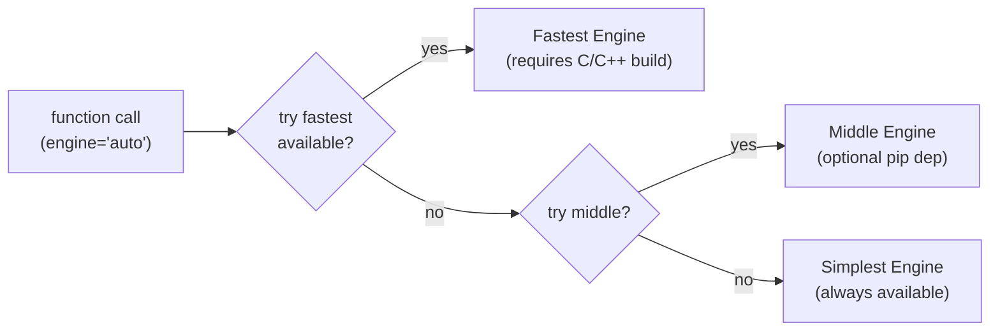
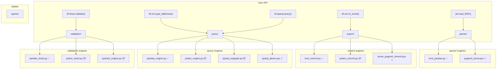

# Target Architecture

Best known target state for the triplets library.

---

## Engine Fallback Pattern

Every submodule with multiple engines follows the same logic — try fastest
available, fall back to simplest:



Engines live inside their own submodule. If a compiled `.so` or optional
dependency isn't present, the import fails silently and the dispatcher
picks the next engine down the chain.

---

## Module Map



✅ always available &nbsp; 📦 optional pip dependency &nbsp; 🔧 requires C/C++ build

---

## Filesystem

```
triplets/
├── __init__.py                  # version, top-level imports, pd.read_RDF
├── _accessor.py                 # three namespaces: df.cim.*, df.shacl.*, df.sparql.*
│
├── parser/
│   ├── __init__.py              # parse() dispatcher, find_all_xml, clean_ID, get_namespace_map
│   ├── lxml_pandas.py           # engine: lxml → pandas DataFrame (default)
│   ├── pugixml_arrow.pyx        # engine: pugixml + arrow → zero-copy (12.9x)
│   └── vendor/
│       └── pugixml/             # vendored pugixml source (MIT, ~300KB)
│
├── query/
│   ├── __init__.py              # dispatchers for tableview/references/filter + sparql
│   ├── pandas_engine.py         # engine: pure pandas (default)
│   ├── polars_engine.py         # engine: polars (4-29x)
│   ├── sparql_oxigraph.py       # engine: oxigraph via oxrdflib
│   └── sparql_qlever.pyx        # engine: libqlever (14-240x)
│       qlever_wrapper.h         # C++ glue for libqlever
│       qlever_wrapper.cpp
│
├── validation/
│   ├── __init__.py              # validate() dispatcher
│   ├── pandas_shacl.py          # engine: pandas (default)
│   ├── polars_shacl.py          # engine: polars (2.4x)
│   ├── pyshacl_engine.py        # engine: pyshacl (external reference impl)
│   ├── rdflib_shacl_parser.py   # parse SHACL constraints from RDF/XML via rdflib
│   ├── triplets_shacl_parser.py # parse SHACL constraints from triplet DataFrames
│   └── shacl_report.py          # SHACL validation report generation
│
├── export/
│   ├── __init__.py
│   ├── excel.py                 # export_to_excel
│   ├── cimxml.py                # export_to_cimxml, generate_xml
│   └── networkx.py              # export_to_networkx
│
├── cgmes/
│   ├── __init__.py
│   └── tools.py                 # CGMES metadata, filename, FullModel utilities
│
├── export_schema/               # ENTSO-E JSON schema files (package data)
│   └── *.json
│
├── rdfs_tools/                  # RDF Schema utilities
│   └── *.py
│
└── rdf_parser.py                # backwards-compatible re-export shim (deprecated)

tests/
├── conftest.py                  # fixtures, markers, skip logic
├── data/
│   ├── tiny_eq.xml              # <20 triples, committed
│   └── tiny_shacl.xml           # minimal SHACL shapes
├── test_parser.py               # lxml_pandas + pugixml_arrow engines
├── test_query.py                # pandas + polars + sparql engines
├── test_validation.py           # pandas + polars + pyshacl engines
├── test_export.py               # excel, cimxml roundtrip
├── test_cgmes.py                # metadata, filenames
├── test_accessor.py             # df.cim.*, df.shacl.*, df.sparql.* namespaces
├── integration/
│   └── test_realgrid.py         # full CGMES dataset
└── benchmarks/
    ├── bench_parser.py
    ├── bench_query.py
    └── bench_sparql.py

docs/
├── benchmarks/
│   ├── parsing.md
│   ├── queries.md
│   ├── shacl.md
│   └── sparql_engines.md
└── guides/
    └── shacl_quickstart.md

pixi.toml
```

---

## Engine Tables

### parser/

| Engine | File | Requires | Speed |
|--------|------|----------|-------|
| `lxml_pandas` | `lxml_pandas.py` | lxml (core dep) | 1x baseline, **always works** |
| `pugixml_arrow` | `pugixml_arrow.pyx` | C++ build + pugixml + pyarrow | 12.9x |

Fallback: `pugixml_arrow` → `lxml_pandas`

### query/

| Engine | File | Requires | Speed | Query type |
|--------|------|----------|-------|------------|
| `pandas` | `pandas_engine.py` | pandas (core dep) | 1x, **always works** | DataFrame |
| `polars` | `polars_engine.py` | `pip install triplets[polars]` | 4-29x | DataFrame |
| `sparql_oxigraph` | `sparql_oxigraph.py` | `pip install triplets[sparql]` | 1x | SPARQL |
| `sparql_qlever` | `sparql_qlever.pyx` | C++ build + libqlever | 14-240x | SPARQL |

Fallback (DataFrame queries): `polars` → `pandas`
Fallback (SPARQL queries): `sparql_qlever` → `sparql_oxigraph`

Future: `mql_engine.py` (CIMdesk Model Query Language), other graph query engines.

### export/

| Engine | File | Requires | Speed |
|--------|------|----------|-------|
| `lxml` | `lxml_cimxml.py` | lxml (core dep) | 1x baseline, **always works** |
| `polars` | `polars_cimxml.py` | `pip install triplets[polars]` | 6.4x |
| `arrow_pugixml` | `arrow_pugixml_cimxml.pyx` | C++ build + pugixml + pyarrow | 11x |

Fallback: `arrow_pugixml` → `polars` → `lxml`

### validation/

| Engine | File | Requires | Speed |
|--------|------|----------|-------|
| `pandas` | `pandas_shacl.py` | pandas (core dep) | 1x, **always works** |
| `polars` | `polars_shacl.py` | `pip install triplets[polars]` | 2.4x |
| `pyshacl` | `pyshacl_engine.py` | `pip install triplets[pyshacl]` | external reference |

Fallback: `polars` → `pandas`
`pyshacl` is explicit only (`engine="pyshacl"`) — not in auto fallback chain.

---

## Dispatcher Pattern

Same structure in every submodule `__init__.py`:

```python
# query/__init__.py

def _auto_engine(df):
    """Pick best available engine for the given DataFrame."""
    if "polars" in type(df).__module__:
        return "polars"
    try:
        import polars
        return "polars"
    except ImportError:
        return "pandas"

def type_tableview(df, *args, engine="auto", **kwargs):
    if engine == "auto":
        engine = _auto_engine(df)
    if engine == "polars":
        from .polars_engine import type_tableview as fn
    else:
        from .pandas_engine import type_tableview as fn
    return fn(df, *args, **kwargs)

def sparql(df, query_str, engine="auto", **kwargs):
    if engine == "auto":
        try:
            from .sparql_qlever import query as fn
        except ImportError:
            from .sparql_oxigraph import query as fn
    elif engine == "sparql_qlever":
        from .sparql_qlever import query as fn
    else:
        from .sparql_oxigraph import query as fn
    return fn(df, query_str, **kwargs)

# ... same pattern for every function
```

---

## Three Accessors

Three separate namespaces, each focused on its domain:

```python
# _accessor.py
import pandas as pd
from . import query, validation, export

# ── df.cim.* — CIM data query & export ──
@pd.api.extensions.register_dataframe_accessor("cim")
class CimAccessor:
    def __init__(self, df):
        self._df = df

    # Query
    def type_tableview(self, *a, **kw):     return query.type_tableview(self._df, *a, **kw)
    def key_tableview(self, *a, **kw):      return query.key_tableview(self._df, *a, **kw)
    def id_tableview(self, *a, **kw):       return query.id_tableview(self._df, *a, **kw)
    def references_to(self, *a, **kw):      return query.references_to(self._df, *a, **kw)
    def references_from(self, *a, **kw):    return query.references_from(self._df, *a, **kw)
    def references(self, *a, **kw):         return query.references(self._df, *a, **kw)
    def filter_by_type(self, *a, **kw):     return query.filter_by_type(self._df, *a, **kw)
    def types_dict(self, **kw):             return query.types_dict(self._df, **kw)

    # Export
    def to_excel(self, path, **kw):         return export.to_excel(self._df, path, **kw)
    def to_cimxml(self, path, **kw):        return export.to_cimxml(self._df, path, **kw)

# ── df.shacl.* — SHACL validation ──
@pd.api.extensions.register_dataframe_accessor("shacl")
class ShaclAccessor:
    def __init__(self, df):
        self._df = df

    def validate(self, rules, **kw):        return validation.validate(self._df, rules, **kw)
    def parse_shapes(self, path, **kw):     return validation.parse_shacl(path, **kw)
    def report(self, violations, **kw):     return validation.report(violations, **kw)

# ── df.sparql.* — SPARQL queries ──
@pd.api.extensions.register_dataframe_accessor("sparql")
class SparqlAccessor:
    def __init__(self, df):
        self._df = df

    def query(self, query_str, **kw):       return query.sparql(self._df, query_str, **kw)

# ── Polars: same three namespaces ──
try:
    import polars as pl

    @pl.api.register_dataframe_namespace("cim")
    class PolarsCimAccessor:
        def __init__(self, df): self._df = df
        def type_tableview(self, *a, **kw): return query.type_tableview(self._df, *a, **kw)
        # ... same methods

    @pl.api.register_dataframe_namespace("shacl")
    class PolarsShaclAccessor:
        def __init__(self, df): self._df = df
        def validate(self, rules, **kw):    return validation.validate(self._df, rules, **kw)

    @pl.api.register_dataframe_namespace("sparql")
    class PolarsSparqlAccessor:
        def __init__(self, df): self._df = df
        def query(self, query_str, **kw):   return query.sparql(self._df, query_str, **kw)

except ImportError:
    pass
```

---

## Usage

```python
import triplets

# ── Parse ──
df = triplets.parser.parse(["grid_EQ.xml"])
df = triplets.parser.parse(["grid_EQ.xml"], engine="pugixml_arrow")
df = pd.read_RDF(["grid_EQ.xml"])                                    # convenience

# ── CIM query (df.cim.*) ──
df.cim.type_tableview("ACLineSegment")
df.cim.type_tableview("ACLineSegment", engine="polars")
df.cim.references_to("some-uuid")
df.cim.types_dict()

# ── SPARQL query (df.sparql.*) ──
df.sparql.query("SELECT ?s WHERE { ?s a cim:Substation }")
df.sparql.query("...", engine="sparql_qlever")

# ── SHACL validation (df.shacl.*) ──
rules = df.shacl.parse_shapes("shapes.xml")
violations = df.shacl.validate(rules)
violations = df.shacl.validate(rules, engine="polars")
violations = df.shacl.validate(rules, engine="pyshacl")

# ── Export (df.cim.*) ──
df.cim.to_excel("output.xlsx")
df.cim.to_cimxml("output.zip")

# ── Direct calls (same API, no accessor needed) ──
triplets.query.type_tableview(df, "ACLineSegment", engine="polars")
triplets.query.sparql(df, "SELECT ...", engine="sparql_qlever")
triplets.validation.validate(df, rules, engine="pyshacl")
```

---

## rdf_parser.py Migration

Current `rdf_parser.py` (2137 lines, 33 functions) → decomposed into modules:

| Functions | New home |
|---|---|
| `load_RDF_*`, `find_all_xml`, `clean_ID`, `get_namespace_map` | `parser/` |
| `type_tableview`, `key_tableview`, `id_tableview`, `references_*`, `filter_by_*`, `types_dict`, `get_object_data`, `update_*`, `remove_*`, `set_VALUE_*`, `diff_*`, `tableview_to_triplet` | `query/` |
| `export_to_excel` | `export/excel.py` |
| `export_to_cimxml`, `generate_xml` | `export/cimxml.py` |
| `export_to_networkx` | `export/networkx.py` |

`rdf_parser.py` becomes a thin re-export shim → deprecation warnings → removal.

---

## pixi.toml

```toml
[project]
name = "triplets"
version = "0.1.0"
description = "RDF/XML toolkit for ENTSO-E/CGMES power grid data"
channels = ["conda-forge"]
platforms = ["linux-64", "osx-arm64", "win-64"]

[dependencies]
python = ">=3.10"
pandas = ">=2.0"
lxml = ">=4.9"
aniso8601 = "*"

[feature.polars.dependencies]
polars = ">=1.0.0"
pyarrow = ">=14.0.0"

[feature.validation.dependencies]
rdflib = ">=6.0"

[feature.pyshacl.dependencies]
rdflib = ">=6.0"
[feature.pyshacl.pypi-dependencies]
pyshacl = ">=0.24.1"

[feature.sparql.pypi-dependencies]
oxrdflib = ">=0.5.0"

[feature.build.dependencies]
cython = ">=3.0"
cmake = ">=3.27"
boost = ">=1.83"
icu = ">=70"
openssl = "*"
zstd = "*"
jemalloc = "*"

[feature.excel.dependencies]
openpyxl = ">=3.1.5"

[feature.dev.dependencies]
pytest = ">=7.0"

[environments]
default = { features = ["validation", "polars", "excel"] }
full = { features = ["validation", "polars", "sparql", "pyshacl", "excel"] }
build = { features = ["validation", "polars", "sparql", "pyshacl", "excel", "build"] }
dev = { features = ["validation", "polars", "sparql", "pyshacl", "excel", "build", "dev"] }

[tasks]
test = "pytest tests/"
test-unit = "pytest tests/ -m 'not integration and not benchmark'"
test-integration = "pytest tests/ -m integration"
bench = "pytest tests/benchmarks/"
build-pugixml-arrow = "cd triplets/parser && cython pugixml_arrow.pyx ..."
build-qlever = "cd triplets/query && cmake ..."
```

---

## Test Harness

Each test file tests **all engines** for its module, skipping when deps are missing:

```python
# test_query.py
import pytest
import triplets

HAS_POLARS = importlib.util.find_spec("polars") is not None
HAS_OXRDFLIB = importlib.util.find_spec("oxrdflib") is not None

class TestPandasEngine:
    def test_type_tableview(self, small_df):
        result = triplets.query.type_tableview(small_df, "Substation", engine="pandas")
        assert len(result) > 0

class TestPolarsEngine:
    pytestmark = pytest.mark.skipif(not HAS_POLARS, reason="polars not installed")

    def test_type_tableview(self, small_df):
        result = triplets.query.type_tableview(small_df, "Substation", engine="polars")
        assert len(result) > 0

class TestSparqlOxigraph:
    pytestmark = pytest.mark.skipif(not HAS_OXRDFLIB, reason="oxrdflib not installed")

    def test_count_query(self, small_df):
        result = triplets.query.sparql(small_df, "SELECT (COUNT(*) AS ?c) WHERE { ?s ?p ?o }")
        assert len(result) > 0

class TestSparqlQlever:
    pytestmark = pytest.mark.native

    def test_count_query(self, small_df):
        result = triplets.query.sparql(small_df, "SELECT ...", engine="sparql_qlever")
        assert len(result) > 0
```

pytest markers:
- `@pytest.mark.integration` — needs `test_data/` submodules
- `@pytest.mark.benchmark` — slow, performance measurement
- `@pytest.mark.native` — needs compiled Cython extensions

---

## Naming Convention

| Pattern | Example | Meaning |
|---|---|---|
| `{lib}_{output}.py` | `lxml_pandas.py` | uses lxml, produces pandas DataFrame |
| `{lib}_{output}.pyx` | `pugixml_arrow.pyx` | uses pugixml, produces arrow tables |
| `{framework}_engine.py` | `pandas_engine.py` | query engine using pandas |
| `{framework}_shacl.py` | `polars_shacl.py` | SHACL validation using polars |
| `{tool}_engine.py` | `pyshacl_engine.py` | validation engine wrapping pyshacl |
| `sparql_{backend}.py` | `sparql_oxigraph.py` | SPARQL query via oxigraph |
| `{source}_shacl_parser.py` | `rdflib_shacl_parser.py` | parse SHACL shapes via rdflib |

---

## Summary

| Principle | Implementation |
|---|---|
| **Engines inside submodules** | `parser/pugixml_arrow.pyx`, `query/sparql_qlever.pyx` |
| **Fallback to simplest** | Auto-detect fastest available, always fall back to pure pandas/lxml |
| **`engine=` everywhere** | Every public function accepts `engine=` parameter |
| **SPARQL under query** | `query/sparql_oxigraph.py`, `query/sparql_qlever.pyx` — alongside pandas/polars |
| **Three accessors** | `df.cim.*` (query/export), `df.shacl.*` (validation), `df.sparql.*` (SPARQL) |
| **Keep pyshacl** | `engine="pyshacl"` in validation |
| **Uniform naming** | `{lib/tool}_{output/purpose}.py` |
| **pixi for builds** | C/C++ deps managed alongside Python |
| **Gradual migration** | `rdf_parser.py` → re-export shim → deprecation → removal |
